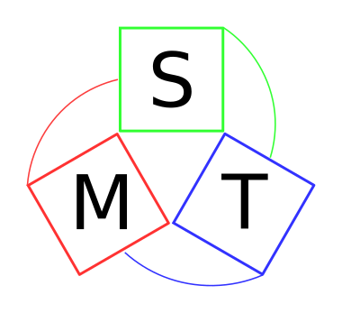

# MST
Multi-Seat Tool

[](https://gitlab.com/gkaz/mst/-/commits/master)

## License
The project was initially written and being developed by "AZ Company
Group" LLC (https://www.gkaz.ru/)  You can find the list of
contributors in `AUTHORS` file.

MST is free software: you can redistribute it and/or modify it under
the terms of the GNU General Public License as published by the Free
Software Foundation, either version 3 of the License, or (at your
option) any later version.  Please see `COPYING` file for the terms of
GNU General Public License.

The logo (`doc/logo.svg` and rasterised versions) is distributed under
terms of [Creative Commons Attribution-ShareAlike 4.0
International](https://creativecommons.org/licenses/by-sa/4.0/).

## Dependencies
* Awesome
* unclutter
* Xephyr
* lightdm
* bash
* libqt5-core
* libudev-devel
* virtualgl
* Xdialog (needed for mst-umount)

## Installation

### AltLinux

An RPM package for the project can be built as follows:
```
$ make -j4 rpm
```
(You should specify apropriate `-j` option according to the number 
of available CPU cores to speed up the building process.)

Installation from the RPM package:

```
$ apt-get install awesome unclutter xorg-xephyr libqt5-core libudev-devel virtualgl qt5-base-devel rpmdevtools
$ useradd multiseat
$ rpm -i mst-1.0.0-1.x86_64.rpm
```

### Ubuntu GNU/Linux (experimental)
Install the needed components:
```
$ sudo apt-get install \
    libudev-dev \
    awesome \
    unclutter \
    xserver-xephyr \
    build-essential \
    qt5-default \
    qtbase5-dev
```

Ubuntu GNU/Linux doesn't have VirtualGL in the official repository, so
you should download `.deb` packages for your system manually from here:
https://sourceforge.net/projects/virtualgl/files/2.6.3/

Then install the downloaded package:
```
$ sudo dpkg -i virtualgl_*.deb
```

## Usage

To make a multi-seat configuation, you should run `mst` program as the
superuser (`root`) and go through the dialogs.

MST assigns a choosen USB port for each seat.  When a USB stick is
plugged to a assigned USB port, it should mount automatically.  The
mount point depends on the seat number and the user logged in on the
seat.  Let's say you have `user1` logged on the 1st seat and `user2`
on the 2nd, and `user1` plugs in a USB stick to the port assigned to
his/her seat.  In this scenario, the mount point will be:

```
/media/user1_1
```

where `user1` is the user login and `1` is the seat number.

To unmount an USB for the current user you should run `mst-umount`
command without any arguments.  The user should be allowed to run
`umount` command without a password.
